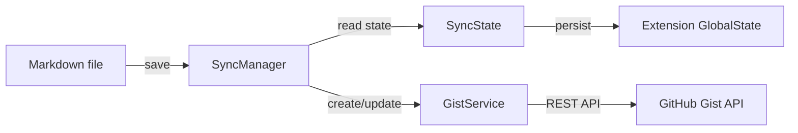

# Gist Sync

[](LICENSE)

Cursor / VS Code 拡張機能。Markdown ファイルで **Sync Mode** をオンにすると、保存時に自動で [GitHub Gist](https://gist.github.com/) へ投稿・更新されます。

## 機能

- Markdown ファイル単位で Sync Mode のオン/オフ
- 保存時の自動同期（デバウンス付き）
- GitHub OAuth 認証（PAT フォールバック対応）
- 初回は Gist 作成、以降は同じ Gist を PATCH で更新
- 既存 Gist へのリンクと同期（Gist 内の他ファイルは変更しない）
- ローカル `.md` のリネームに追随し、Gist 上の旧ファイル名を置き換え
- Gist URL / Raw URL をワンクリックでコピー
- 上書きモードで既存 Gist ファイル名へリンク
- ステータスバーに同期状態を表示

## インストール

### VSIX から（推奨）

```bash
git clone https://github.com/manji-0/gist-sync.git
cd gist-sync
devbox run bootstrap
devbox run package
cursor --install-extension dist/gist-sync-0.1.2.vsix --force
```

Cursor / VS Code をリロード（**Developer: Reload Window**）してください。

### 開発用に実行

```bash
git clone https://github.com/manji-0/gist-sync.git
cd gist-sync
devbox run bootstrap
devbox run dev
```

## クイックスタート

1. コマンドパレット → **Gist Sync: Sign in to GitHub**（`gist` スコープ）
2. `.md` ファイルを開く
3. **Gist Sync: Toggle Sync Mode** で Sync Mode をオン
4. 保存すると Gist に同期される

## 認証

デフォルト（`gistSync.authMethod`: `auto`）では **GitHub OAuth** を使います。

| `authMethod` | 動作 |
|--------------|------|
| `auto` | OAuth → 失敗時 PAT フォールバック |
| `oauth` | OAuth のみ |
| `pat` | PAT のみ（Secret Storage に保存） |

PAT は **Gist Sync: Set Personal Access Token** から登録してください。設定ファイルへの平文保存は非推奨です（レガシー設定は起動時に Secret Storage へ移行されます）。

## 開発

[devbox](https://www.jetify.com/devbox) を使う場合:

```bash
devbox run bootstrap   # pnpm install
devbox run compile
devbox run test
devbox run package     # dist/*.vsix
devbox run dev         # Extension Development Host
```

devbox なし:

```bash
pnpm install
pnpm run compile
pnpm test
pnpm run package
pnpm run dev
```

## コマンド

| コマンド | 説明 |
|---------|------|
| Gist Sync: Sign in to GitHub | GitHub OAuth でサインイン |
| Gist Sync: Toggle Sync Mode | 現在の Markdown ファイルの同期オン/オフ |
| Gist Sync: Sync Now | 手動で即時同期 |
| Gist Sync: Open Gist in Browser | 紐づいた Gist を開く |
| Gist Sync: Copy Gist URL | Gist ページ URL（または Raw URL）をコピー |
| Gist Sync: Link to Existing Gist | 既存 Gist を URL/ID で登録（ファイル選択） |
| Gist Sync: Link to Gist (Overwrite) | Gist URL を登録し、ローカルファイル名で上書き同期 |
| Gist Sync: Unlink Gist | ファイルと Gist の紐づけを解除 |
| Gist Sync: Set Personal Access Token | PAT を Secret Storage に保存 |
| Gist Sync: Clear GitHub Token | 保存済み PAT を削除 |

## 設定 (`gistSync.*`)

| 設定 | デフォルト | 説明 |
|------|-----------|------|
| `authMethod` | `auto` | 認証方式（`auto` / `oauth` / `pat`） |
| `syncOnSave` | `true` | 保存時に自動同期 |
| `gistDescription` | `""` | 新規 Gist の説明（空ならファイル名） |
| `gistPublic` | `false` | 公開 Gist にするか |
| `debounceMs` | `500` | 保存後の同期までの待ち時間（ms） |

## アーキテクチャ



## ライセンス

[MIT](LICENSE) © 2026 [manji-0](https://github.com/manji-0)
