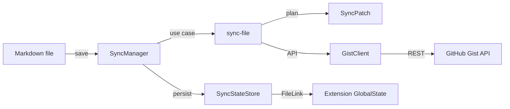

# Gist Sync

[](LICENSE)

A Cursor / VS Code extension that syncs Markdown files to [GitHub Gist](https://gist.github.com/) when **Sync Mode** is enabled for that file.

## Features

- Per-file Sync Mode (on/off)
- Auto-sync on save with debounce
- GitHub OAuth with PAT fallback
- Create a new Gist on first sync, then PATCH the same Gist afterward
- Link an existing Gist (other files in the Gist are left unchanged)
- Follow local `.md` renames and replace the old filename on the Gist
- Copy Gist page URL or raw file URL
- Overwrite mode to link and sync under the local filename
- Status bar with context-aware click actions
- Automatic migration from legacy `gistSync.mappings` storage

## Install

### From GitHub Releases

Download the latest [release](https://github.com/manji-0/gist-sync/releases/latest) VSIX.

**GitHub CLI:**

```bash
gh release download --repo manji-0/gist-sync --pattern '*.vsix' -D /tmp
cursor --install-extension /tmp/gist-sync-*.vsix --force
```

**curl:**

```bash
curl -fsSL -o /tmp/gist-sync.vsix \
  "$(gh api repos/manji-0/gist-sync/releases/latest --jq '.assets[] | select(.name | endswith(".vsix")) | .browser_download_url')"
cursor --install-extension /tmp/gist-sync.vsix --force
```

Use `code` instead of `cursor` on VS Code.

After installing, run **Developer: Reload Window**.

### Build from source

```bash
git clone https://github.com/manji-0/gist-sync.git
cd gist-sync
devbox run bootstrap
devbox run package
cursor --install-extension dist/gist-sync-*.vsix --force
```

## Quick start

1. Command Palette → **Gist Sync: Sign in to GitHub** (`gist` scope)
2. Open a `.md` file
3. Click the status bar item (**Gist Sync: OFF**) or run **Gist Sync: Enable Sync**
4. Choose **Create new Gist** or **Link existing Gist**
5. Save the file to keep it in sync

## Status bar

| State | Click action |
|-------|----------------|
| Sync **OFF** | Quick Pick: create a new Gist or link an existing one (enables sync) |
| Sync **ON** + linked Gist | Copy Gist URL (page or raw) |
| Sync **ON** + no link yet | Toggle sync off |

## Authentication

Default (`gistSync.authMethod`: `auto`) uses **GitHub OAuth**.

| `authMethod` | Behavior |
|--------------|----------|
| `auto` | OAuth, then PAT fallback |
| `oauth` | OAuth only |
| `pat` | PAT only (stored in Secret Storage) |

Set a PAT via **Gist Sync: Set Personal Access Token**. Plain-text tokens in `settings.json` are deprecated and migrated to Secret Storage on activation.

**Dependency:** requires the built-in `vscode.github-authentication` extension.

## Commands

| Command | Description |
|---------|-------------|
| Gist Sync: Enable Sync | Enable sync with new Gist or existing Gist link |
| Gist Sync: Toggle Sync Mode | Toggle sync for the current Markdown file |
| Gist Sync: Sync Now | Sync immediately |
| Gist Sync: Open Gist in Browser | Open the linked Gist |
| Gist Sync: Copy Gist URL | Copy the Gist page or raw URL |
| Gist Sync: Link to Existing Gist | Link by URL/ID (pick file when needed) |
| Gist Sync: Link to Gist (Overwrite) | Link and sync under the local filename |
| Gist Sync: Unlink Gist | Remove the file↔Gist link (Gist is not deleted) |
| Gist Sync: Sign in to GitHub | GitHub OAuth sign-in |
| Gist Sync: Set Personal Access Token | Save PAT to Secret Storage |
| Gist Sync: Clear GitHub Token | Clear saved PAT |

## Settings (`gistSync.*`)

| Setting | Default | Description |
|---------|---------|-------------|
| `authMethod` | `auto` | `auto` / `oauth` / `pat` |
| `syncOnSave` | `true` | Sync when a synced file is saved |
| `gistDescription` | `""` | Description for new Gists (empty → filename) |
| `gistPublic` | `false` | Create public Gists |
| `debounceMs` | `500` | Delay after save before sync (ms) |

## Architecture

Layered Kamae-style structure (domain / application / boundary / infrastructure / presentation):



| Layer | Responsibility |
|-------|----------------|
| **domain** | `GistId`, `GistFilename`, `FileLink`, `SyncPatch`, `SyncError` |
| **boundary** | Zod validation for GitHub API responses |
| **application** | `sync-file`, `link-file-to-gist` use cases |
| **infrastructure** | GitHub client, VS Code auth & persistence |
| **presentation** | `SyncManager`, `StatusBar` |

Runtime dependencies (`zod`, `neverthrow`) are bundled with **esbuild** into `out/extension.js` for VSIX packaging.

## Development

With [devbox](https://www.jetify.com/devbox):

```bash
devbox run bootstrap   # pnpm install
devbox run compile     # esbuild bundle (minified)
devbox run test        # tsc --noEmit + vitest
devbox run package     # dist/*.vsix
devbox run dev         # Extension Development Host
```

Without devbox:

```bash
pnpm install
pnpm run compile
pnpm test
pnpm run package
pnpm run dev
```

`pnpm run watch` rebuilds with source maps for local debugging.

## License

[MIT](LICENSE) © 2026 [manji-0](https://github.com/manji-0)
